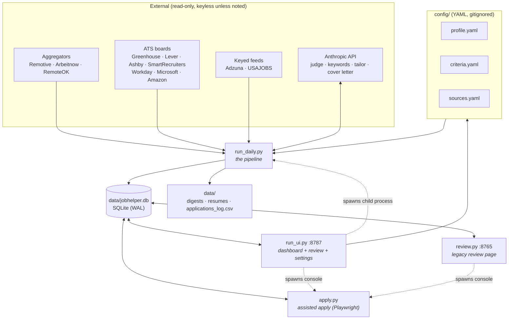
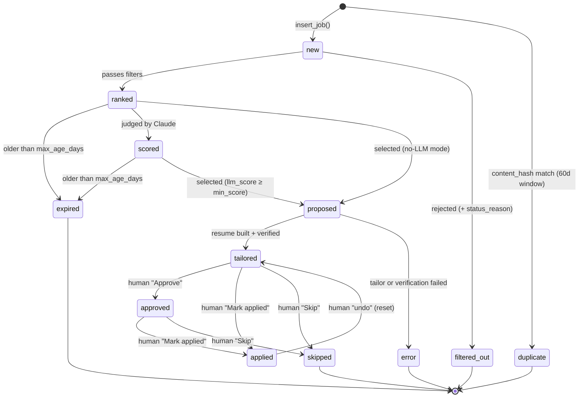

# JobHelper — Architecture & Developer Guide

**Audience:** whoever maintains this code (usually future-you, months later).
**Scope:** how the system is put together and why. For *setup and day-to-day
usage*, see [README.md](../README.md); this document assumes it runs and explains
what happens inside.

**Last verified against the code:** 2026-07-25.

---

## Contents

1. [System overview](#1-system-overview)
2. [Process flow — the daily run](#2-process-flow--the-daily-run) ← start here
3. [Job lifecycle (status state machine)](#3-job-lifecycle-status-state-machine)
4. [Data model](#4-data-model)
5. [Module map](#5-module-map)
6. [Runtime surfaces](#6-runtime-surfaces)
7. [Configuration](#7-configuration)
8. [Design invariants](#8-design-invariants)
9. [Extension recipes](#9-extension-recipes)
10. [Testing](#10-testing)
11. [Known gaps & gotchas](#11-known-gaps--gotchas)

---

## 1. System overview

JobHelper is a single-user, locally-run tool. There is no server, no
multi-tenancy, no auth: one SQLite file, some YAML, and a few Python processes
that a human starts (or Task Scheduler starts on their behalf).

Four things can be running, and they are deliberately loosely coupled — each
talks to the same SQLite DB rather than to each other:



Key structural facts:

- **The DB is the only integration point.** The dashboard does not import the
  pipeline; it shells out to `run_daily.py` and reads the resulting rows.
- **Everything AI is optional.** Without `ANTHROPIC_API_KEY` the pipeline still
  completes end to end — lexical ranking, full-profile resume, no cover letter.
  `LLM.available` is the single gate (`llm.py`).
- **Nothing is ever submitted.** Assisted apply fills a form and stops; a human
  clicks Submit. This is an invariant, not a current limitation — see §8.

---

## 2. Process flow — the daily run

This is the heart of the system: [`src/jobhelper/pipeline.py`](../src/jobhelper/pipeline.py),
one function, `run()`, executed top to bottom. Every stage is gated on the job
`status` column, so a re-run never re-sources, re-judges, or re-proposes work
that already happened — the pipeline is **idempotent and resumable by
construction**.

```mermaid
flowchart TD
    START([run_daily.py]) --> LOAD["Load .env + profile/criteria/sources<br/>open DB · migrate · start_run(run_id)"]

    LOAD --> SRC["<b>1 · SOURCE</b><br/>build_sources() → each adapter .fetch()<br/>per-source failure is isolated"]
    SRC --> DED{"<b>2 · DEDUPE</b><br/>insert_job()"}
    DED -->|"job_hash seen"| DROP([no row — silently skipped])
    DED -->|"content_hash seen<br/>within 60 days"| DUP([status = duplicate])
    DED -->|"genuinely new"| NEW([status = new])

    NEW --> FILT{"<b>3 · HARD FILTER</b><br/>rank/filters.passes()<br/>deterministic · zero cost"}
    FILT -->|fails| FOUT([status = filtered_out<br/>+ status_reason])
    FILT -->|passes| RANKED([status = ranked])

    RANKED --> EXP{"<b>3.5 · EXPIRE</b><br/>older than max_age_days?"}
    EXP -->|yes| EXPIRED([status = expired])
    EXP -->|no| POOL[["<b>the pool</b><br/>ranked + scored"]]

    POOL --> RECALL["<b>4a · RECALL SCORE</b><br/>rank/scoring.Scorer<br/>semantic embeddings, else lexical cosine<br/>→ embed_score (0..1)"]

    RECALL --> HASKEY{ANTHROPIC_API_KEY?}
    HASKEY -->|no| SELECT
    HASKEY -->|yes| SHORT["<b>4b · SHORTLIST</b><br/>unjudged jobs, <i>this cycle's arrivals first</i>,<br/>then backlog — top llm_shortlist (15)"]
    SHORT --> JUDGE["<b>4c · JUDGE</b><br/>rank/llm_judge.Judge → Claude<br/>fit_score 0-100 + met/missing/rationale"]
    JUDGE --> SCORED([status = scored])
    SCORED --> SELECT

    SELECT["<b>5 · SELECT</b><br/>LLM mode: llm_score ≥ min_score, best first<br/>no-LLM mode: rank by embed_score<br/>then _select_diverse(daily_target, max_per_company)"]
    SELECT --> PROPOSED([status = proposed<br/>+ proposed_in_run_id])

    PROPOSED --> TAILOR
    subgraph TAILOR["<b>6 · TAILOR</b> — per proposed job, errors isolated"]
        direction TB
        T1["extract_keywords() — separate LLM call<br/><i>the checker, not the writer</i>"]
        T2["select_variant() — pure code, role-family emphasis"]
        T3["tailor_resume() — LLM may only reword/select profile facts"]
        T4["build_resume() → ATS-safe single-column .docx"]
        T5{"structural_failures()<br/>re-read the saved file"}
        T6["build_ats_report() — coverage · frequency · metric-once · distinctive"]
        T7["cover_letter() + screening_answers()"]
        T1 --> T2 --> T3 --> T4 --> T5
        T5 -->|failures| TERR([status = error])
        T5 -->|clean| T6 --> T7
    end
    T7 --> TAILORED([status = tailored])

    TAILORED --> DIGEST["<b>7 · DIGEST</b><br/>digest/digest.render_digest()<br/>→ data/digests/digest-YYYY-MM-DD.md"]
    DIGEST --> FIN["finish_run(counts) → run_log"]
    FIN --> HUMAN{{"<b>HUMAN</b> — dashboard :8787 / review :8765<br/>Approve · Mark applied · Skip · Assisted apply"}}
```



### Stage reference

| # | Stage | Code | Status in → out | Cost | Governed by |
|---|-------|------|-----------------|------|-------------|
| 1 | **Source** | `sources/registry.build_sources` + one adapter per feed | — → `new` / `duplicate` | HTTP, throttled | `sources.yaml` |
| 2 | **Dedupe** | `db.insert_job` | (at insert) | free | `CONTENT_DUP_WINDOW_DAYS = 60` (code) |
| 3 | **Hard filter** | `rank/filters.passes` | `new` → `ranked` / `filtered_out` | free | `criteria.yaml` |
| 3.5 | **Expire** | `pipeline._expire_stale` | `ranked`/`scored` → `expired` | free | `max_age_days` |
| 4a | **Recall score** | `rank/scoring.Scorer` | (writes `embed_score`) | CPU (local model) | `scoring` |
| 4b | **Shortlist** | `pipeline._shortlist_fresh_first` | (ordering only) | free | `llm_shortlist` |
| 4c | **Judge** | `rank/llm_judge.Judge` | `ranked` → `scored` | 1 Claude call/job | `judge_model` |
| 5 | **Select** | `pipeline._select_diverse` | → `proposed` | free | `daily_target`, `min_score`, `max_per_company` |
| 6 | **Tailor** | `tailor/*` | `proposed` → `tailored` / `error` | 3 Claude calls/job | `tailor_model` |
| 7 | **Digest** | `digest/digest.render_digest` | (read-only) | free | — |

### The five decisions worth understanding

**Why the filter runs before any scoring.** Stage 3 is pure string matching over
config lists. It throws away the overwhelming majority of sourced jobs at zero
cost, so embeddings and Claude only ever see plausible candidates. Any new
rejection rule that *can* be expressed deterministically belongs here, not later.

**Why there are two scores.** `embed_score` (0..1) is *recall* — cheap, applied
to the whole pool, only meaningful as a ranking. `llm_score` (0..100) is
*precision* — expensive, applied to ~15 jobs a day, calibrated in absolute terms.
`min_score` is therefore only applied in LLM mode; in no-LLM mode the pipeline
ranks by `embed_score` and takes the top `daily_target` with no threshold,
because a lexical cosine has no absolute meaning. (Note: the comment in
`criteria.example.yaml` describes `min_score` as also applying to a "scaled
lexical score" — the code does not do this.)

**Why the pool expires and the shortlist is fresh-first.** The freshness filter
in stage 3 only sees jobs on the way *in*. Without stage 3.5 the `ranked`/
`scored` pool accumulates dead postings forever, and — because the shortlist was
originally ordered by `embed_score` alone — a large unjudged backlog could starve
brand-new postings out of the judge queue for days. `_shortlist_fresh_first`
splits on `first_seen_at >= previous completed run's started_at`: this cycle's
arrivals claim slots first, the backlog fills what's left.

**Why the keyword table is a separate LLM call.** `extract_keywords()` distills
the JD into a ranked term table; `tailor_resume()` then writes against it; and
`build_ats_report()` measures coverage on text re-extracted from the *saved
.docx*. Three separate steps so the coverage report is never the writer grading
its own homework, and so the thing measured is the artifact a parser actually
sees — not the dict we hoped we rendered.

**Why per-job errors don't fail the run.** Stage 6 wraps each job in
`try/except`: a failed tailor marks that row `error` and the batch continues. The
same applies per-source in stage 1. A single bad JD or a flaky board never costs
you the day's digest.

---

## 3. Job lifecycle (status state machine)

`status` is the pipeline's control flow. Every stage selects by status and writes
a new one; nothing else coordinates the stages.



| Status | Meaning | Set by |
|--------|---------|--------|
| `new` | Ingested, not yet filtered | `db.insert_job` |
| `duplicate` | Same content as a live row seen in the last 60 days; kept for harvester evidence + source metrics, but no stage ever selects it | `db.insert_job` |
| `filtered_out` | Failed a deterministic rule; `status_reason` says which | stage 3 |
| `ranked` | In the pool, awaiting/past recall scoring | stage 3 |
| `expired` | Aged out of the pool | stage 3.5 |
| `scored` | Judged by Claude | stage 4c |
| `proposed` | Selected for today | stage 5 |
| `tailored` | Resume built and verified; **this is the "pending review" state** | stage 6 |
| `error` | Tailoring or structural verification failed; `error_text` has the reason | stage 6 |
| `approved` / `applied` / `skipped` | Human decisions | `review/actions.apply_action` |

"Pending review" in the UI means `proposed`, `tailored`, or `approved`
(`review.actions.PENDING` / `web.metrics.PENDING_STATUSES` — keep those in sync).

---

## 4. Data model

One SQLite file, `data/jobhelper.db`, WAL mode. Schema lives in `db.SCHEMA`;
`db.init_db()` runs it plus hand-written `ALTER TABLE` migrations for columns
added after a DB already existed (`SCHEMA` is `CREATE TABLE IF NOT EXISTS`, so
editing it alone never reaches a live database — **new columns need a migration
block too**).

### `jobs` — one row per posting

| Group | Columns |
|-------|---------|
| Identity | `id`, `job_hash` (UNIQUE), `content_hash`, `source`, `source_job_id`, `url` |
| Posting | `title`, `company`, `location`, `remote_type`, `salary_min/max/currency`, `candidate_location`, `description_raw`, `description_clean`, `tags`, `date_posted`, `first_seen_at` |
| Scoring | `embed_score` (REAL 0..1), `llm_score` (INT 0..100), `llm_musthaves_met`, `llm_missing`, `llm_rationale` |
| Artifacts | `tailored_resume_path`, `cover_letter_text`, `change_log`, `screening_answers`, `ats_report` |
| State | `status`, `status_reason`, `proposed_in_run_id`, `approved_at`, `applied_at`, `error_text`, `created_at`, `updated_at` |

JSON-shaped columns are stored as TEXT; `db.update_job` serializes lists/dicts
automatically, and readers use `review.actions.loads_json` / `digest._loads`.

**Two dedupe layers** (`models.RawJob` + `db.insert_job`):

- `job_hash` = hash of the apply URL, or `source + source_job_id` when the URL is
  volatile (`RawJob.volatile_url` — Adzuna signs its URLs per request, so the
  same ad would otherwise hash differently every fetch). `UNIQUE`, enforced by
  `INSERT OR IGNORE`: the same posting fetched again produces no row at all.
- `content_hash` = hash of `company + title + description_clean`, `NULL` when any
  of those is blank (too thin to compare safely). A match against a live row
  first seen in the last 60 days parks the new row as `duplicate` — this catches
  the same ad posted once per city, or reposted under a fresh aggregator ad id.
  Older matches are treated as a genuinely re-opened req and enter normally.

**`update_job` writes are whitelisted.** `db._WRITABLE` lists every column the
function may set; anything else raises `KeyError`. Adding a column means adding
it in three places: `SCHEMA`, the `init_db` migration block, and `_WRITABLE`.

### `run_log` — one row per pipeline run

`run_id` (UTC `YYYYMMDDTHHMMSS`), `started_at`, `finished_at`, and the counters
`sourced`, `new_jobs`, `filtered`, `scored`, `proposed`, `errors`. A row with
`finished_at IS NULL` is a run that crashed or is still going — the dashboard
labels it `incomplete` unless the run manager says it's live, and
`db.previous_run_started_at()` skips it so its arrivals still count as "fresh".

Duplicates are counted in-memory and logged but **not persisted** — there is no
column for them.

### `source_suggestions` — the harvester inbox

`UNIQUE(kind, token)`, `status` in `suggested` / `accepted` / `dismissed`, plus
provenance (`via` = `url` | `redirect` | `guess`), the evidence that triggered it,
and the live-verification result. Dismissed suggestions stay dismissed across
rescans.

### Files on disk (all under `data/`, gitignored)

| Path | Written by |
|------|-----------|
| `jobhelper.db` | everything |
| `digests/digest-YYYY-MM-DD.md` | stage 7 |
| `resumes/<date>/<job_id>/<Name>_<Title>.docx` | stage 6 |
| `applications_log.csv` | `applog.record_application` |
| `backups/<name>-<timestamp>.yaml` | `web/settings_store.backup` |
| `cache/*.json` | `sources/base.Fetcher` (write-through; only *read* with `--use-cache`) |
| `logs/ui-run-*.log` | `web/runner.RunManager` |
| `browser_profile/` | Playwright persistent context (assisted apply) |

---

## 5. Module map

```
src/jobhelper/
├── pipeline.py         THE ORCHESTRATOR — read this first
├── db.py               SQLite schema, migrations, status queries, run_log
├── models.py           RawJob dataclass + the two dedupe hashes
├── config.py           .env + YAML loaders, profile-derived helpers
├── llm.py              Anthropic wrapper: .available, .structured(), .text()
├── util.py             paths, logger, HTML→text, hashing, date parsing
├── applog.py           applications_log.csv upsert/remove (keyed by job_id)
├── harvest.py          roster harvester: aggregator copies → direct ATS sources
│
├── sources/            ONE ADAPTER PER FEED
│   ├── base.py             JobSource ABC + Fetcher (throttle · retry · cache)
│   ├── registry.py         build_sources(): sources.yaml → adapter instances
│   ├── remotive/arbeitnow/remoteok.py      keyless aggregators (no config)
│   ├── greenhouse/lever/ashby/smartrecruiters.py   keyless, per-company slugs
│   ├── workday.py          keyless CXS API; {tenant, dc, site} triples + searches
│   ├── microsoft.py        Eightfold "pcsx" API; items are SEARCH QUERIES
│   ├── amazon.py           amazon.jobs search API; items are SEARCH QUERIES
│   ├── usajobs.py          KEYED (USAJOBS_API_KEY); federal, remote-scoped
│   └── adzuna.py           KEYED (ADZUNA_APP_ID/KEY); truncated descriptions
│
├── rank/
│   ├── filters.py          passes() — the deterministic hard filter
│   ├── scoring.py          Scorer — semantic (granite-small-r2) or lexical
│   └── llm_judge.py        Judge — Claude fit score + met/missing/rationale
│
├── tailor/
│   ├── keywords.py         JD keyword extraction + boundary-aware matcher
│   ├── variants.py         role-family emphasis presets (pure code selection)
│   ├── tailor.py           passthrough + LLM resume, cover letter, screening
│   ├── resume_docx.py      ATS-safe single-column .docx renderer
│   └── verify.py           re-read the saved file: structural + report checks
│
├── digest/digest.py    daily Markdown digest
│
├── review/             LEGACY review page (:8765)
│   ├── actions.py          SHARED enrich/act/launch logic (both UIs use this)
│   └── app.py              server-rendered FastAPI page
│
├── apply/              ASSISTED APPLY (Playwright)
│   ├── fillers.py          ATS detection, apply URL, field matching
│   ├── screening.py        knockout-question polarity + option picking
│   └── runner.py           drive the browser, fill, print summary, STOP
│
└── web/                DASHBOARD (:8787)
    ├── app.py              FastAPI: /api/* + SPA fallback for web/dist
    ├── metrics.py          read-only aggregate queries
    ├── runner.py           RunManager: spawn run_daily.py, buffer + SSE logs
    ├── review.py           review endpoints (delegates to review/actions.py)
    ├── schemas.py          pydantic response/request models
    ├── settings_api.py     /api/settings/* routes
    ├── settings_schemas.py validation models for the three YAML files
    ├── settings_store.py   comment-preserving YAML load/merge/backup/atomic save
    ├── source_verify.py    live "does this board exist" check via the real adapter
    └── resume_import.py    .docx/.txt/.md → profile proposal (Claude)
```

Frontend (`web/`, React 19 + Vite + Tailwind 4 + TanStack Query + Recharts,
builds to `web/dist` which FastAPI serves):

```
web/src/
├── App.tsx                 routes: / · /runs · /review · /settings
├── api/{client,hooks,types}.ts
├── components/
│   ├── dashboard/          funnel · sources · recent jobs
│   ├── run/                RunPanel · RunsTable · useRunStream (SSE)
│   ├── review/             ReviewJobCard · PendingReviewTile · DoneList
│   ├── settings/           Profile/Sources/Criteria sections · ResumeImportCard
│   │                       RosterTable · SuggestionsInbox · useDraft
│   └── ui/                 small primitives (button, card, badge, toast, …)
└── pages/                  Dashboard · Runs · Review · Settings
```

### The three cross-cutting rules in this layout

1. **`review/actions.py` is shared on purpose.** Both UIs route status changes
   through `apply_action()` so they can never drift on transitions or
   applications-log bookkeeping. Put review logic there, not in either app.
2. **`sources/` adapters are the only place that knows a vendor's JSON.**
   Everything downstream sees `RawJob`.
3. **`web/settings_store.py` is the only writer of config YAML.** It round-trips
   through `ruamel.yaml` to preserve comments and ordering, backs up first, and
   writes atomically. `harvest.merge_accept()` goes through it too.

---

## 6. Runtime surfaces

| Entry point | Port | What it is |
|-------------|------|------------|
| `run_daily.py` | — | The pipeline. Task Scheduler target. `--use-cache` replays cached HTTP for dev. |
| `run_ui.py` | 8787 | Dashboard: metrics, run control with live logs, review, settings. The main surface. |
| `review.py` | 8765 | Legacy standalone review page. Still works; superseded by the dashboard's Review tab. |
| `apply.py` | — | Assisted apply. `--next` picks the highest-scored pending job; `--headless` fills + screenshots for testing. |

### Dashboard API (`web/app.py` + `web/settings_api.py`)

| Method & path | Purpose |
|---------------|---------|
| `GET /api/summary` | Headline tiles (last run, proposed today, pending, applied 7d/total) |
| `GET /api/funnel` | Current job counts per status, in pipeline order |
| `GET /api/timeline?days=` | Daily new / proposed / applied series |
| `GET /api/sources` | Per-source totals, 7-day new, surfaced count, avg LLM score |
| `GET /api/runs?limit=` | `run_log` rows + `run_state` (complete / running / incomplete) |
| `GET /api/jobs/recent?limit=` | Recently surfaced jobs with a display score |
| `POST /api/run` | Start a run (409 if one is in progress) |
| `GET /api/run/status` | Run manager state |
| `GET /api/run/logs` | **SSE** stream: replays buffered lines past `after`, follows live, ends with `done` |
| `GET /api/review/jobs` | Pending + done lists, enriched |
| `POST /api/review/jobs/{id}/action` | `applied` / `approve` / `skip` / `reset` |
| `GET /api/review/jobs/{id}/resume` | Download the tailored .docx |
| `POST /api/review/jobs/{id}/assist` | Launch assisted apply in its own console |
| `GET /api/review/applications.csv` | Download the applications log |
| `GET/PUT /api/settings/{profile\|sources\|criteria}` | Read/save a config file |
| `POST /api/settings/sources/verify` | Live-check one board with its real adapter |
| `GET/POST /api/settings/sources/suggestions[...]` | Harvester inbox: list · scan · accept · dismiss |
| `POST /api/settings/profile/import-resume` | Upload a resume → profile proposal |

The SPA catch-all route is registered **last** so `/api/*` always wins, and it
resolves paths against `web/dist` with a traversal guard.

### Run control

`web/runner.RunManager` (module-level singleton `MANAGER`) spawns
`run_daily.py` as a child process — one at a time, lock-guarded. Output lines go
into a bounded `deque` (4000 lines) for SSE replay *and* to
`data/logs/ui-run-*.log`. Run history and counters are **not** duplicated here;
the pipeline writes them to `run_log` itself.

### The harvester

`harvest.py` closes the loop from aggregators back to direct sources. Aggregator
listings are delayed copies of postings that live on an employer's ATS; when a
company's copies keep clearing the filter (≥2 surviving jobs in 30 days, or any
LLM score ≥ `min_score`), its board belongs in `sources.yaml`. The scan extracts
board candidates three ways — ATS URL patterns in the stored job, best-effort
resolution of the aggregator's redirect, then slug guesses from the company name
— tags each with its provenance (`via`), live-verifies before suggesting, and
persists to `source_suggestions`. Accepting merges into `sources.yaml` through
the settings store. Guessed slugs can collide with an unrelated company's board,
which is exactly why `via` is surfaced in the UI and a human accepts.

---

## 7. Configuration

Four files, all gitignored, all with a tracked `.example` twin.

| File | Governs | Edited from |
|------|---------|-------------|
| `config/profile.yaml` | **Master profile** — the single source of truth for every resume fact | Settings → Profile, or by hand |
| `config/criteria.yaml` | Filtering, selection, scoring mode, models | Settings → Criteria |
| `config/sources.yaml` | Which feeds are on, the curated board roster, crawl knobs | Settings → Sources |
| `.env` | `ANTHROPIC_API_KEY`, `USAJOBS_API_KEY`, `ADZUNA_APP_ID/KEY` | by hand |

`config.load_env()` is a deliberately dependency-free `.env` reader: it strips
surrounding quotes and **never overwrites a real environment variable**.

### Criteria keys, by the stage they control

| Key | Code default | Stage |
|-----|--------------|-------|
| `exclude_companies`, `title_include_any`, `title_exclude_any`, `keywords_any`, `keywords_exclude` | — | 3 filter |
| `remote_required`, `onsite_ok_companies`, `allowed_location_tokens` | `True`, —, — | 3 filter |
| `salary_floor` | `0` | 3 filter (only when a salary is listed) |
| `max_age_days` | — | 3 filter **and** 3.5 expiry |
| `scoring` | `"auto"` | 4a |
| `llm_shortlist` | `15` | 4b |
| `judge_model` | `claude-sonnet-4-6` | 4c |
| `min_score` | `55` | 5 (**LLM mode only**) |
| `daily_target` | `4` | 5 (ceiling, not a quota) |
| `max_per_company` | `1` | 5 |
| `tailor_model` | `claude-opus-4-8` | 6 (judge, keywords, tailor, cover letter) |

Values in the shipped `criteria.example.yaml` differ from these code fallbacks
(e.g. `daily_target: 6`, `max_per_company: 2`); the fallbacks only apply when a
key is absent.

Some knobs are **deliberately code constants**, not config — changing them is a
code change with a test: `keywords.FREQUENCY_CAP` (4), `keywords.JD_CHAR_CAP`
(15 000), `verify.METRIC_CAP` (2), `verify._SURVIVAL_THRESHOLD` (0.6),
`variants.MIN_SIGNAL_HITS` (2), `db.CONTENT_DUP_WINDOW_DAYS` (60),
`tailor.DISPLAY_AS_MAX` (60).

### Profile shape (what the tailor reads)

`identity` (name, contact, links, `credentials_line`, work-authorization fields)
· `summary` · `skills.hard_skills` (each optionally `{name, group}`) and
`certifications` · `work_history[].achievements[]` (each optionally
`{text, distinctive: true}`) · `education` · `compensation` · `eeo` ·
`variants` (role-family presets: `signals`, `summary_angle`,
`skills_group_order`, `default`).

`distinctive: true` marks a memorable, verifiable specific — `verify.py` warns if
none survive tailoring. `group` turns the flat skills line into labelled,
parse-safe `Label: a, b, c` lines.

---

## 8. Design invariants

These are load-bearing. Breaking one is a behavioral regression even if tests
pass, so they are called out explicitly.

1. **Nothing is ever submitted on the user's behalf.** `apply/runner.py` opens
   the form, fills fields, answers what it can, prints a verification summary,
   and stops. The only clicks it makes are `_APPLY_OPENERS` in
   `_ensure_form_visible()` — which returns early the moment an email field is
   already on the page, so it fires on the landing page, never on a filled form.
2. **No LinkedIn/Indeed automation, ever.** Their seeker APIs are closed, and
   automating logged-in sessions carries documented account-restriction risk. The
   only ATS channel is a company's own hosted form.
3. **Truthful tailoring by construction.** Companies, titles, and dates are
   copied verbatim from the profile in `passthrough_resume()`; the LLM may only
   reword/select bullets from *that job's own* achievements, write a summary, and
   reorder *existing* skills. Assembly filters anything invented — a skill not in
   the profile is dropped; a `display_as` alias must contain its canonical skill
   (boundary-aware) and stay under 60 chars or it silently falls back.
4. **Checker ≠ writer.** Keyword extraction is its own call, and coverage is
   measured on text re-extracted from the saved `.docx`. Never fold these into
   the tailor call.
5. **Missing skills are flagged, never fabricated.** `missing_required` surfaces
   JD requirements the candidate genuinely lacks.
6. **No hidden text, ever.** `verify.structural_failures` scans for hidden or
   white runs and fails the job. ATSs treat that as manipulation.
7. **Boundary-aware matching, not `\b`.** `keywords.term_pattern` builds guards
   from the term's edge characters because `\b` never matches `C#`, `.NET`, or
   `C++`. Every term match in the codebase goes through it.
8. **Config writes preserve comments.** The YAML files are documentation as much
   as configuration. Only `settings_store.save()` writes them — backup first,
   atomic write, comments and ordering intact.
9. **The pipeline is idempotent.** Statuses gate every stage; re-running is
   always safe (which is what makes "run task as soon as possible after a missed
   start" safe in Task Scheduler).
10. **`update_job` writes are whitelisted.** No stage may quietly invent a column.

---

## 9. Extension recipes

### Add a job source

1. Write `sources/<name>.py`: subclass `JobSource`, implement `fetch()`, return
   `RawJob`s. Use `self.fetcher.get_json()` / `.post_json()` (throttle, retry,
   and caching come free) and `util.html_to_text()` for descriptions. Respect
   `self.cap`. If it needs a key, check for it and log a hint + return `[]`
   rather than raising — the daily run must still complete.
2. Register it in `sources/registry.build_sources()` under the right config
   shape (slug list vs. search queries vs. tenant dicts).
3. Add it to `web/source_verify._build()` so the Settings **Verify** button works.
4. Add the key to `sources.example.yaml` with a comment explaining the token
   format, and to `settings_schemas.py` so the Settings form accepts it.
5. Add a parsing case to `tests/test_sources_parsing.py` (offline, fixture JSON).
6. If it's an aggregator whose listings originate elsewhere, add it to
   `harvest.AGGREGATOR_SOURCES`.

Set `volatile_url = True` on the `RawJob` if the source signs its URLs per
request, or dedupe will break.

### Add a hard-filter rule

Add it to `rank/filters.passes()`, return `(False, "<human reason>")` — the
reason lands in `status_reason` and is visible in the UI. Add the config key to
`criteria.example.yaml` and `settings_schemas.py`. Prefer this over any
post-scoring filtering: it's free and it's explainable.

### Add a `jobs` column

Three edits, or it silently doesn't work: (a) `db.SCHEMA`, (b) an
`if "<col>" not in cols: ALTER TABLE` block in `db.init_db` — `SCHEMA` is
`CREATE TABLE IF NOT EXISTS` and never reaches an existing DB, (c) `db._WRITABLE`
if any code writes it. `tests/test_db_migration.py` covers migration idempotency.

### Add a dashboard metric

Query in `web/metrics.py` (read-only, `finally: conn.close()`, use SQLite's
`'localtime'` modifier for day buckets since timestamps are UTC) → response model
in `web/schemas.py` → route in `web/app.py` → hook in `web/src/api/hooks.ts` →
component.

### Add a role-family variant

Pure config: add an entry under `variants` in `profile.yaml` with `signals`,
`summary_angle`, and `skills_group_order`. Selection is deterministic code — a
variant wins when ≥2 of its signal terms appear in the job's title/description,
evaluated in profile order, with the `default: true` entry as fallback.

---

## 10. Testing

Tests are plain scripts (`python tests/test_x.py`), no pytest required. They fall
in three tiers:

- **Offline unit** — no network, no API key, no DB: `test_keywords`,
  `test_verify`, `test_tailor_ats`, `test_tailor_wiring`, `test_variants`,
  `test_filters_remote`, `test_select_diverse`, `test_screening`,
  `test_apply_matching`, `test_sources_parsing`, `test_settings_store`,
  `test_applog`.
- **DB-level** — temp SQLite: `test_db_migration`, `test_dedupe`,
  `test_pool_expiry`, `test_harvest`.
- **In-process smoke** — FastAPI TestClient with stubbed LLM/adapters/run:
  `test_review_smoke`, `test_web_smoke`, `test_web_review_smoke`,
  `test_web_settings_smoke`.

Run everything:

```bash
for f in tests/test_*.py; do python "$f" || echo "FAILED: $f"; done
```

Two habits worth keeping: tests must be **config-resilient** (they run on a
machine whose `criteria.yaml` you can't predict — don't assert on the user's real
config), and anything touching the anti-hallucination assembly or the ATS-safe
renderer gets a test, because those failures are silent and land in front of a
recruiter.

---

## 11. Known gaps & gotchas

- **The digest filename is date-based, not run-based.** A second run on the same
  day overwrites `digest-YYYY-MM-DD.md`. The DB keeps both runs; the file doesn't.
- **Duplicates aren't persisted per run.** `run_log` has no column for them, so
  the count only appears in the run's log output.
- **Adzuna descriptions are truncated (~500 chars).** Good enough for the hard
  filter, but the judge sees far less text than for direct sources — expect
  systematically lower `llm_score` from that lane.
- **USAJOBS is a watch lane.** Probing found effectively zero remote public
  software inventory; it's kept because a DoD clearance is an asset if postings
  appear.
- **Embedding scores are model-specific.** `scoring._MODEL_ID` is
  `granite-embedding-small-english-r2`; its scores run ~0.85–0.90 for good
  matches where the older MiniLM ran ~0.5–0.7. All downstream use is rank-based,
  but **don't mix scores from two models in one pool** — change the model and the
  existing `embed_score` values are no longer comparable.
- **Semantic scoring is a ~2–3 GB CPU install.** `scoring: lexical` skips it
  entirely; the Claude judge still does the precise scoring either way.
- **Workday apply stays manual by design** (multi-step, login-gated). The review
  card instead surfaces a copy-ready, JD-prioritized skills list for Workday's
  structured skills fields.
- **`.claude/worktrees/` contains full copies of the repo.** Repo-wide greps and
  file searches will hit them; scope searches to `src/`, `tests/`, and `web/`.

---

## Related documents

- [README.md](../README.md) — setup, usage, roadmap, research rationale
- [docs/ats-resume-optimization-research.md](ats-resume-optimization-research.md) — the July 2026 ATS research brief the tailoring rules implement
- [docs/ats-tailoring-implementation-handoff.md](ats-tailoring-implementation-handoff.md) — ITEM-8 design decisions (keyword extraction, verification)
